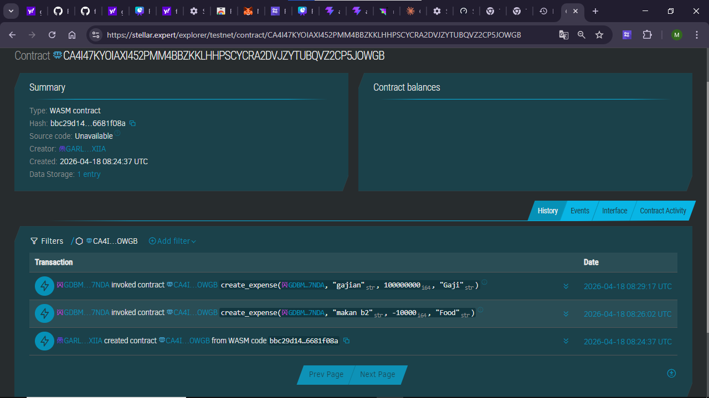
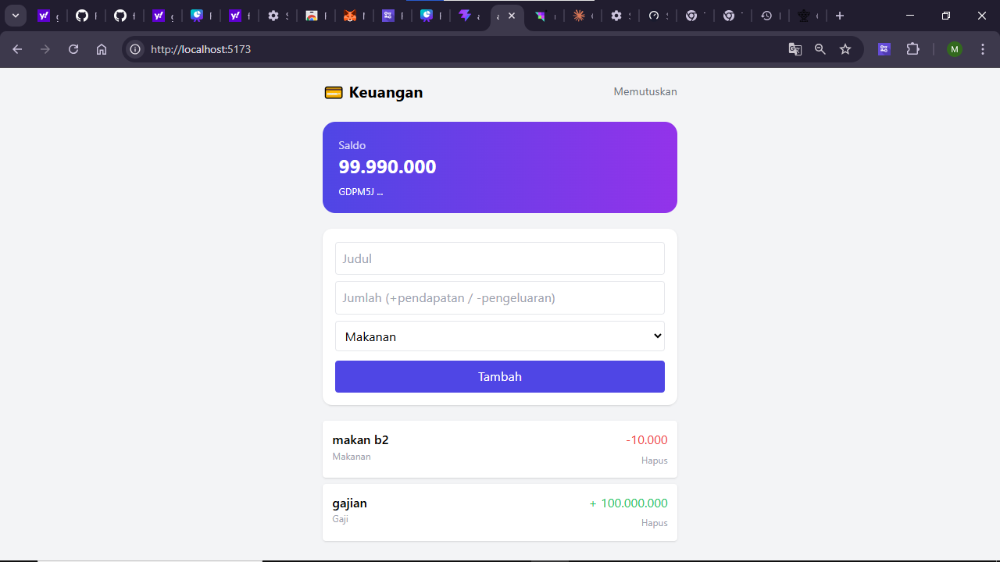

# Stellar Notes DApp

**Stellar Notes DApp** - Blockchain-Based Decentralized Note-Taking System

---

## Project Description

Stellar Notes DApp is a decentralized smart contract application built on the Stellar blockchain using the Soroban SDK. It provides a secure and immutable platform for managing personal notes directly on-chain. All data is stored transparently and can only be accessed or modified through predefined smart contract functions, removing reliance on centralized database systems.

The system enables users to create, retrieve, and delete notes using the efficiency of the Stellar network. Each note is uniquely identified and stored in the contract’s instance storage, ensuring persistence, integrity, and reliability.

---

## Project Vision

Our vision is to revolutionize personal productivity in the digital era by:

- **Decentralizing Data**: Moving note storage from centralized servers to a distributed blockchain network
- **Ensuring Ownership**: Giving users full control and ownership of their digital information
- **Guaranteeing Immutability**: Ensuring notes cannot be tampered with by any third party
- **Enhancing Privacy**: Leveraging blockchain security to protect user data
- **Building Trustless Systems**: Relying on code-based guarantees rather than centralized authorities

We aim to create a future where digital information is sovereign, transparent, and user-controlled.

---

## Key Features

### 1. Note Management
- Create notes with title and content
- Automatic unique ID generation
- Stored permanently on the Stellar blockchain

### 2. Data Retrieval
- Fetch all notes in a single contract call
- Structured response for frontend integration
- Real-time synchronization with blockchain state

### 3. Secure Deletion
- Delete notes by unique ID
- Immediate update of contract storage
- Permanent removal from blockchain state

### 4. Transparency & Security
- All actions recorded on-chain
- Immutable transaction history
- Protection against unauthorized modifications

### 5. Stellar Integration
- Built on Soroban Smart Contract SDK
- Fast and low-cost blockchain operations
- Scalable architecture for future growth

---

## Contract Details

- **Contract Address**:  
  `CAWLJENIINEZJFQFC5VCB6VNRVJGSXO2L7DORGXLDNVBKT26RRHTUQFJ`

---

## Frontend Preview

---

## Future Scope

### Short-Term Enhancements
- Note encryption for enhanced privacy
- Tags and categories for organization
- Markdown / rich text support
- Advanced search functionality

### Medium-Term Development
- Collaborative notes with multi-signature access
- Notification system for updates
- Asset/token attachments to notes
- Inter-contract communication support

### Long-Term Vision
- Cross-chain note synchronization
- Decentralized frontend hosting (IPFS)
- AI-powered note summarization
- Zero-knowledge privacy layers
- DAO-based governance system
- Decentralized identity (DID) integration

### Enterprise Features
- Corporate documentation system
- Immutable audit logging
- Automated reporting triggers
- Multi-language support

---

## Technical Requirements

- Rust programming language
- Soroban SDK
- Stellar blockchain network

---

## Getting Started

Deploy and interact with the smart contract using the following functions:

- `create_note(title, content)` → Create a new note
- `get_notes()` → Retrieve all stored notes
- `delete_note(id)` → Delete a note by ID

---

## Summary

**Stellar Notes DApp** brings secure, transparent, and decentralized note-taking to the blockchain era—ensuring your thoughts remain truly yours.

---
